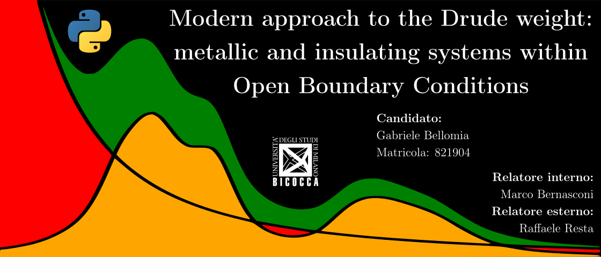

# What is pyDrude?
This repository records the *python* code I have written for my master-thesis project, as it standed at the date of graduation. Some minor polishing may be ahead, but further development is not planned as the project already migrated to *matlab* (i.e. it has been ported, extended and debugged in that language). Please notice that almost surely the code hides some critical bug, as it contains old and unmantained source files. I advice to not use it and instead refer to the matlab version, available in a new repository.
# What was the thesis about?
**Title:**
*"Modern approach to the Drude weight: metallic and insulating systems within Open Boundary Conditions"*

**Abstract:**
Irrelevance of boundary conditions in the thermodynamic limit is a basic tenet of statistical mechanics and condensed matter physics. Among the possible choices of boundary conditions two are prominent: Born-von-Kàrmàn periodic boundary conditions (PBCs) and the so called “open” boundary conditions (OBCs), which address e.g. a bounded crystallite. Insofar as an intensive physical observable is computed from finite realizations of a given system, the two choices yield somewhat different results. Yet one postulates that the large-system limit yields the same value for any intensive physical observable.

The Drude weight D (also called adiabatic charge stiffness) measures the effective charge density contributing to dc conductivity in a metal; it has a simple expression within PBCs and is nonzero even at finite size. Within OBCs, instead, the dc conductivity is zero at any size and D apparently vanishes. The frequency-dependent conductivity σ(ω) is generally comprised of a Drude term and of a regular part: the Kubo formulæ yield both, but only if PBCs are adopted; the two terms altogether obey the f-sum rule.

In this thesis work we show how to extract the D value from σ(ω) evaluated from the OBCs Kubo formula. At any finite size and zero temperature, the conductivity is a sum of δ-like peaks (poles in the complex plane) both within OBCs and PBCs. In the former case all poles are at ω ≠ 0; in the latter case one of the poles is at ω = 0 and its strength yields D.

We have performed thorough simulations by adopting simple 1D model potentials, in order to deal with the three paradigmatic cases: (i) free electrons, where the PBCs D value is trivial and the regular conductivity vanishes; (ii) a model insulator, where D = 0 and the regular term saturates the f-sum rule; (iii) a model metal, where D is nontrivial, and the conductivity includes a regular part.

The model system is insulating or metallic according to where the Fermi level is set; the exact OBCs solutions are expanded in terms of the eigenstates of the 1D flat potential well of length L. Analogous results are produced within PBCs for comparison. The numerical accuracy is therefore affected from two different sources: the finite-basis expansion and the cutoff in the Kubo perturbation formula. We summarize below the most relevant results.

(i) Free electrons. In this case the eigenstates are exact and the convergence depends on the cutoff only. The OBCs conductivity σ(ω) has solely low-frequency poles, which accumulate towards zero in the large-L limit. We found that the number of relevant poles increases with L, their spacing scales like 1/L and their residues are asymptotically L-independent. The sum of the residues saturates the f-sum rule quickly. Our key message is that for increasing L all OBCs poles coalesce into a single one at ω = 0, having the correct strength D.

(ii) Model insulator. In this case D is zero and we know from general arguments that the converged OBCs and PBCs conductivities must be identical. We found, however, that the convergence rates of the two calculations are quite different; as a consequence, the OBCs and PBCs forms of σ(ω) remain significantly different up to rather large sizes.

(iii) Model metal. Based on PBCs simulations, we address a case study where D and the regular term in σ(ω) account for about the 75% and 25% of the f-sum rule, respectively. The corresponding OBCs Kubo formula displays two series of poles, qualitatively different both in their energy range and in their large-L behavior. The D value is easily extracted from on of the two, in the same way as in (i) above; the f-sum rule suffers from the same convergence issues as in (ii), causing even more severe deviations in the calculated large-size conductivities.
